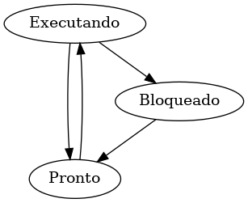

## Questão 1
Familiarize-se com a chamada: fork(2), wait(2), execl(3);
Descreva o funcionamento das funções listadas acima.

### Resposta
**`fork`**:

**`wait`**:

**`execl`**:

## Questão 2
Na figura 1 são mostrados três estados de processos. 

Na teoria, com três estados poderia haver seis transições, duas para cada estado. Contudo, somente quatro transições são mostradas. Há alguma circunstância na qual uma delas ou ambas as transições não ilustradam possam ocorrer?

### Resposta
Segundo Tanenbaum, um processo em estado conceitualmente pronto pode ser 
parado por que a CPU precisa alocar recursos para outro processo por um tempo.

## Questão 3
O que é um processo Zumbi? Explique como que um processo passe para o estado de Zumbi.

## Questão 4
Escreva um programa que gere um processo Zumbi.

## Questão 5
Considere a seguinte parte de um programa: 

    p=fork();
    a=fork();

    printf("Sistemas Operacionais\n");

Quantas vezes é apresentada "Sistemas Operacionais"? Justifique.

Quantos processos são criados pelo programa?

## Questão 6
Faça um programa que crie 2 processos e:
- Escreve `Eu sou o pai` no processo pai;
- Escreve `Eu sou o 1o filho` no primeiro filho;
- Escreve `Eu sou o 2o filho` no segundo filho.

## Questão 7
Considere o seguinte pedaço de código em C:  

    for(i=0;i<4;i++)
      pid=fork();
    printf("FSO\n");

Quantos processos são criados por este programa? Justifique.
Quantas vezes é apresentado "FSO"? Justifique.